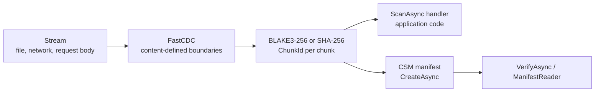

<h1>
  <picture>
    <source media="(prefers-color-scheme: dark)" srcset="assets/logo-dark.svg">
    
  </picture>
</h1>

**Deterministic content-defined chunking and verifiable binary manifests for .NET.**

[](https://www.nuget.org/packages/ChunkShift)
[](https://www.nuget.org/packages/ChunkShift)
[](https://github.com/MrFr3di/ChunkShift/actions/workflows/ci.yml)
[](#compatibility)
[](#compatibility)
[](LICENSE)

ChunkShift splits any `Stream` into content-defined chunks, gives each chunk a stable 256-bit content identity, and records the result in a compact binary manifest (CSM) that can be read and verified later. Chunk boundaries follow the content rather than fixed offsets, so insertions or deletions do not force every later block to move with them.

Use it to deduplicate stored uploads and build artifacts, measure how much content two versions can reuse, or verify large binary files against a manifest. Processing is streaming and bounded-memory, and Core does not require a server, dependency injection, or ASP.NET Core.

## Highlights

- **Stable content-defined boundaries.** FastCDC allows unchanged regions to be recognized again after insertions or deletions shift byte offsets.
- **Content-addressed chunks.** Chunk identities use BLAKE3-256 by default, with SHA-256 available as a compatibility HashSuite.
- **Deterministic.** The same bytes produce the same chunk boundaries and identities across supported architectures and execution modes.
- **Streaming and bounded-memory.** Forward-only and non-seekable `Stream` inputs are supported without full-file materialization.
- **Compact, verifiable manifests.** CSM records chunk identity and length while keeping logical manifest identity separate from the exact physical file representation.
- **Small Core surface.** No DI container, ASP.NET dependency, repository abstraction, or public strategy-interface zoo.
- **NativeAOT-friendly.** Core is designed for trimming and NativeAOT-compatible consumption.

## Install

```bash
dotnet add package ChunkShift
```

## Quick start

### Chunk a stream

The handler runs once per chunk, in order. The scanner waits for each callback to complete before continuing, which naturally provides backpressure.

`content` is borrowed memory: consume or copy it before the returned `ValueTask` completes.

```csharp
using ChunkShift;

await using FileStream source = File.OpenRead("build.bin");

await ChunkScanner.ScanAsync(
    source,
    (chunk, content, cancellationToken) =>
    {
        Console.WriteLine(
            $"{chunk.Offset} {chunk.Length} {chunk.Id}");

        return ValueTask.CompletedTask;
    });
```

ChunkShift does not dispose the source stream.

### Create and verify a manifest

```csharp
using ChunkShift;

await using (FileStream content = File.OpenRead("build.bin"))
await using (FileStream manifest = new(
    "build.csm.tmp",
    FileMode.CreateNew,
    FileAccess.Write,
    FileShare.None))
{
    ManifestInfo info =
        await ChunkManifest.CreateAsync(content, manifest);

    Console.WriteLine(
        $"{info.ManifestId}: {info.ChunkCount} chunks");
}

// Publish only after CreateAsync succeeds.
File.Move("build.csm.tmp", "build.csm");

await using (FileStream content = File.OpenRead("build.bin"))
await using (FileStream manifest = File.OpenRead("build.csm"))
{
    ManifestVerificationResult result =
        await ChunkManifest.VerifyAsync(content, manifest);

    Console.WriteLine(
        result.IsValid
            ? "valid"
            : $"invalid: {result.Failures}");
}
```

Content mismatches are reported through `ManifestVerificationResult`. Malformed or unsupported manifest input is handled according to the documented API contract.

### Read a manifest without loading it all

```csharp
using ChunkShift;

await using FileStream file = File.OpenRead("build.csm");
await using ManifestReader reader =
    await ManifestReader.OpenAsync(file);

var batch = new ChunkInfo[1024];

int count;
while ((count = await reader.ReadAsync(batch)) > 0)
{
    for (int i = 0; i < count; i++)
    {
        Console.WriteLine(
            $"{batch[i].Offset} {batch[i].Length} {batch[i].Id}");
    }
}

Console.WriteLine(reader.VerificationResult?.IsValid);
```

Complete console and ASP.NET Core examples live under [`samples/`](samples/README.md).

## Common tasks

| Goal | API |
| --- | --- |
| Store each unique chunk of an upload or artifact once | `ChunkScanner.ScanAsync`, keyed by `chunk.Id` |
| Measure reusable content between versions | Read one manifest with `ManifestReader` and scan the other version with `ChunkScanner.ScanAsync` |
| Check content against a manifest | `ChunkManifest.VerifyAsync(content, manifest)` |
| Check a manifest without the original content | `ChunkManifest.VerifyManifestAsync(manifest)` |
| Use SHA-256 instead of BLAKE3 | Set the HashSuite in `ChunkScanOptions` or `ManifestCreationOptions` |
| Process large ASP.NET Core uploads | Pass `HttpRequest.Body` and `HttpContext.RequestAborted` directly ([guide](docs/ASPNET-CORE.md)) |

## How it works



| Term | Meaning |
| --- | --- |
| `ChunkId` | Hash of the exact chunk bytes under the selected HashSuite. |
| HashSuite | Selects the persistent content hash algorithm used for chunk and manifest identities. |
| Chunking profile | Stable FastCDC boundary semantics. The default profile is `fastcdc.gear.chunkshift.v1.64k`. |
| `ProfileFingerprint` | 256-bit digest of the exact profile semantics recorded with the profile identity. |
| `ManifestId` | Logical identity of the manifest: profile, HashSuite, and ordered chunk sequence. |
| `FileDigest` | Digest of the exact physical CSM bytes. Physical layout changes can change this without changing `ManifestId`. |

The default profile uses:

```text
minimum: 16 KiB
target:  64 KiB
maximum: 256 KiB
```

Its stable profile fingerprint is:

```text
054e6ced561558147f9c35dc66c64142fd4562d21132f0dc51e00544c04200a0
```

## Stability

| Contract | Stability |
| --- | --- |
| Core `0.1.x` public package | Pre-1.0. Breaking API changes remain possible and must be explicit in release notes. |
| Default FastCDC profile and fingerprint | Persisted contract. Existing identifiers are never silently reinterpreted. |
| HashSuite identifiers and hash domains | Persisted contract. |
| CSM format and logical identity semantics | Persisted contract. |
| `ManifestId` vs `FileDigest` distinction | Persisted semantic contract. |

Performance work does not redefine persisted identity. An optimized implementation must reproduce the same contract-defined output unless a reviewed compatibility change introduces a new identity/version.

## Compatibility

| Area | Support |
| --- | --- |
| Target frameworks | `net8.0`, `net10.0` |
| NativeAOT | Supported |
| Trimming | Supported |
| Input model | Forward-only and non-seekable `Stream` |
| ASP.NET Core | Direct `HttpRequest.Body` composition; no Core dependency on ASP.NET |
| Determinism | Architecture-independent persisted semantics |

See [`docs/SUPPORT.md`](docs/SUPPORT.md) for the detailed support matrix.

## Repository map

```text
src/ChunkShift/        Core implementation
tests/                 correctness, compatibility and package-consumer gates
samples/               minimal console and ASP.NET Core consumers
docs/architecture/     normative contracts (API, CSM, FastCDC, profile fingerprint)
docs/                  hosting, support and release policy
tools/conformance/     independent FastCDC and CSM reference tooling
AGENTS.md              standing rules for coding agents
CONTRIBUTING.md        contribution workflow
```

### For coding agents

Read [`AGENTS.md`](AGENTS.md) before modifying the repository.

Use this README for orientation, then find the nearest relevant specification and tests before changing compatibility-sensitive behavior. Stable vectors, persisted identifiers, format semantics, ownership, and cancellation rules are contracts, not implementation details to rewrite casually.

## Building from source

Requires the .NET 10 SDK and the .NET 8 runtime for the `net8.0` test target.

```bash
dotnet restore ChunkShift.slnx
dotnet build ChunkShift.slnx -c Release --no-restore
dotnet test ChunkShift.slnx -c Release --no-build --no-restore
```

## Documentation

- [Core 0.1 API contract](docs/architecture/CORE-0.1-API.md)
- [CSM v1 format specification](docs/architecture/CSM-V1.md)
- [FastCDC profile semantics](docs/architecture/FASTCDC-V1.md)
- [Profile fingerprint](docs/architecture/PROFILE-FINGERPRINT-V1.md)
- [Hosting in ASP.NET Core](docs/ASPNET-CORE.md)
- [Samples](samples/README.md)
- [Support matrix](docs/SUPPORT.md)
- [Release policy](docs/RELEASES.md)
- [Changelog](CHANGELOG.md)

## Contributing

Issues and pull requests are welcome. See [`CONTRIBUTING.md`](CONTRIBUTING.md).

Changes to public API, persisted identities, binary formats, profile/hash semantics, or other compatibility-sensitive behavior require explicit review.

Coding agents should also read [`AGENTS.md`](AGENTS.md).

## Security

Report suspected vulnerabilities privately according to [`SECURITY.md`](SECURITY.md).

## License

[MIT](LICENSE)
